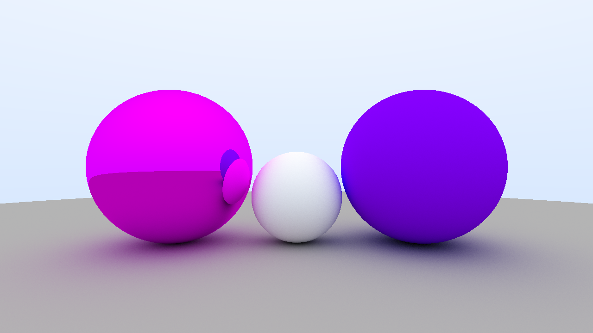

# ray-tracer 🌠

A hobby CPU-based ray tracer built from scratch in Rust

## Resources

The resources I used to learn this stuff:

- https://raytracing.github.io/books/RayTracingInOneWeekend.html
- https://pbr-book.org/
- https://github.com/TheCherno/RayTracing

## License

[GPLv3](LICENSE) © [Asandei Stefan](https://asandei.com)
